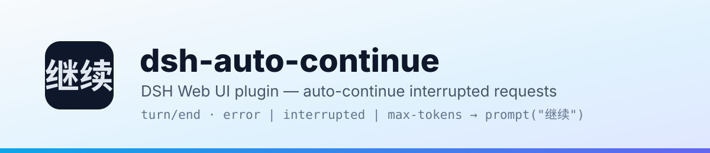
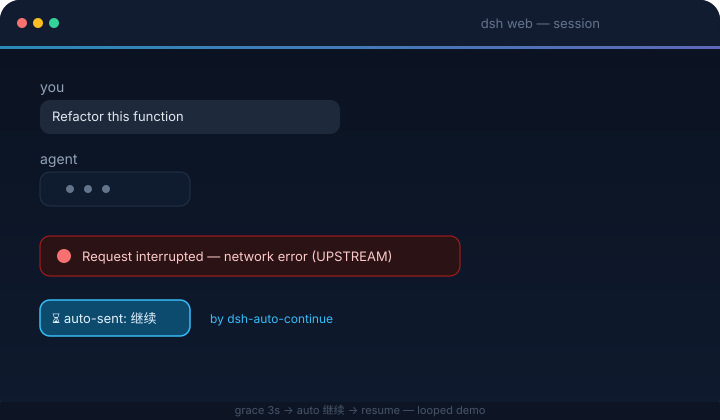

<p align="center">
  <picture>
    <source media="(prefers-color-scheme: dark)" srcset="docs/banner-dark.svg">
    
  </picture>
</p>

<h1 align="center">dsh-auto-continue</h1>

<p align="center">
  <em>DSH Web UI plugin — when a request is interrupted by a network error or any other non-human cause, it automatically types 「继续」 and sends it for you.</em>
</p>

<p align="center">
  <a href="https://www.npmjs.com/package/dsh-client-auto-continue"></a>
  <a href="https://www.npmjs.com/package/dsh-client-auto-continue"></a>
  <a href="https://github.com/HsiangNianian/dsh-auto-continue/stargazers"></a>
  <a href="https://github.com/HsiangNianian/dsh-auto-continue/blob/main/LICENSE"></a>
  <br>
  
  
  
</p>

<p align="center">
  <b>English</b> · <a href="README.zh.md">中文</a>
</p>

---

## What It Does

For [DeepSeek Harness](https://github.com/deepseek-ai/deepseek-harness) (`dsh web`): whenever a request in the web GUI gets interrupted by a **non-human cause**, the plugin simulates the user typing **「继续」** and sends it, so the agent keeps working without manual intervention. The message enters the session log exactly like a manual prompt — the model sees it, and the interrupted work resumes.



**Smart recovery** (all configurable):

- **Error classification** — transient failures (network / timeout / 5xx…) are auto-resumed; permanent ones (auth, balance, unknown model, context overflow) are **skipped** and notified, because retrying them never helps
- **Adaptive backoff** — consecutive failures wait longer each time (e.g. 20s → 40s → 80s), instead of hammering a broken upstream
- **Templated continue text** — `continueText` supports `{code}` `{message}` `{status}` `{tool}` `{turn}` placeholders, so the resume message can carry the failure context ("继续 (git push failed: UPSTREAM)")
- **Browser notifications** — optional alerts when auto-continue fires, gives up, or hits a permanent error

It watches the live event streams and reacts to:

| Event | Meaning |
| --- | --- |
| `turn/end` → `error` | Turn failed (model / network / timeout, …) |
| `turn/end` → `interrupted` | Crash-orphaned turn left behind by a host restart |
| `turn/end` → `max-tokens` | Output token ceiling reached |
| `host/agent-error` | Agent failure with no turn position |

**Never auto-continues:** user-aborted turns (`aborted`) or policy rejections (`blocked`); sessions the host already resumed itself; running sessions or sessions with queued messages; subagent sessions; anything inside the cooldown / consecutive-cap windows (configurable in the settings card, below).

---

## How It Works

The plugin opens two extra SSE streams in the browser — `events.mux` (session events) and `events.host` (host events). The host supports multiple consumers, so this never interferes with the built-in runtime. On an interruption it waits a **grace period** (default 3 s) — if the host starts a new turn by itself (`turn/start`), the auto-continue is cancelled — then calls `sessions.prompt` in `queue` mode with the configured text.

On page load / reconnect it also scans the most recently updated sessions: a session whose last turn ended with a non-human reason **within the scan window** (default 15 minutes), with no later `turn/start` or user message, gets resumed automatically too (e.g. the host crashed while the browser was closed).

All knobs live in the plugin's settings card — see [Configuration](#configuration).

---

## Quick Start

DSH plugins install into a **profile** (`dsh web` → `web` profile). Install, restart `dsh web`, done.

### From npm (recommended)

Published as [`dsh-client-auto-continue`](https://www.npmjs.com/package/dsh-client-auto-continue):

```bash
dsh plugin --profile web add dsh-client-auto-continue
dsh web
```

### From this repository

Requires Node.js ≥ 18.

```bash
git clone https://github.com/HsiangNianian/dsh-auto-continue.git
cd dsh-auto-continue
npm install
npm run build

# the package carries its own cordis.patch.yml (dsh.bundle.patch),
# so the plugin row registers itself
dsh plugin --profile web add link:$(pwd)

dsh web
```

### Manual (no pnpm / dsh plugin needed)

```bash
ln -sfn "$(pwd)" ~/.dsh/profiles/node_modules/dsh-client-auto-continue
# then append to ~/.dsh/profiles/web/cordis.patch.yml:
#   - insert:
#       - id: auto-continue
#         name: 'dsh-client-auto-continue'
dsh web
```

> Switching from a manual install to `dsh plugin add`? Remove the manual `insert` entry first — the bundle patch registers the row and a duplicate would conflict.

> **Known DSH limitation (0.1.0-rc.6):** the web plugin-configuration section only
> exposes settings namespaces on a hardcoded allowlist in the installed
> `@deepseek-ai/dsh-host-apiproxy` bundle. Until upstream moves exposure into
> `settings.register()`, one idempotent vendor patch is required for the
> settings card to appear (re-run it after reinstalling dsh):
>
> ```sh
> node node_modules/dsh-client-auto-continue/scripts/patch-expose.mjs
> dsh web
> ```
>
> The patch script ships inside the npm package (no repo clone needed) and
> covers every reachable dsh installation: the profile-linked copy, a global
> `npm i -g @deepseek-ai/dsh` install, and the invoking directory's own. The
> auto-continue engine itself works without this patch — it only gates the
> GUI settings card.

### Verify & uninstall

```bash
dsh --profile web --dump-config | grep auto-continue   # config layer mounted
```

In the browser console (Ctrl/Cmd+Shift+I): `[auto-continue] 已启动(文本="继续", …)` — every detection and auto-send is logged.

```bash
dsh plugin --profile web remove dsh-client-auto-continue   # npm / repo install
# or remove the symlink + the insert entry                  # manual install
dsh web
```

---

## Configuration

Everything is configurable from the GUI — no file or console edits needed. Open **Settings → Plugin configuration** and find the **Auto continue** card. Changes are staged and written on **Save**, apply immediately, and persist in `~/.dsh/settings.yaml`.

| Field | Default | Description |
| --- | --- | --- |
| Continue text | `继续` | Text automatically sent after an interruption |
| Grace period (ms) | `3000` | Wait after an interruption; cancelled if the host recovers on its own |
| Cooldown (ms) | `20000` | Min interval between auto-continues per session (failed attempts count too) |
| Max consecutive | `3` | Max consecutive auto-continues; stops until a user intervenes or a turn completes |
| Scan on load / reconnect | `on` | Scan recently interrupted sessions on load / reconnect |
| Scan limit | `8` | Max sessions scanned (running / subagent sessions excluded) |
| Scan window (ms) | `900000` | Scan only considers interruptions inside this window |
| Reconnect scan delay (ms) | `5000` | Delay before scanning after a reconnect |
| Reconnect backoff (ms) | `3000` | SSE reconnect backoff |
| Verbose logs | `on` | `[auto-continue]` console logs |
| Classify errors | `on` | Auto-resume transient failures only; auth / balance / model errors are skipped and notified |
| Backoff factor | `2` | Cooldown multiplier per consecutive failure (2 = 20s → 40s → 80s…) |
| Max backoff (ms) | `300000` | Cap on the adaptive backoff interval |
| Browser notifications | `off` | Notify when auto-continue fires, gives up, or hits a permanent error |

`continueText` accepts the placeholders `{code}`, `{message}`, `{status}`, `{tool}` (last tool call before the failure) and `{turn}` — e.g. `继续 ({tool}: {code})` becomes `继续 (git push: UPSTREAM)`.

---

## Development

```bash
npm run typecheck   # tsc --noEmit
npm run build       # lib/client.js + lib/index.js + lib/types
npm run watch       # rebuild on change; host HMR hot-reloads without a page refresh
npm run test        # node tests/simulate.mjs — 12 behavioral scenarios
```

While `npm run watch` runs, the profile's client-hmr row polls `lib/client.js` every 500 ms and hot-reloads the plugin in the browser — no server restart needed for code changes.

---

## Activity

[](https://gitstock.org/HsiangNianian/dsh-auto-continue)

---

## Links

- **Repository**: [github.com/HsiangNianian/dsh-auto-continue](https://github.com/HsiangNianian/dsh-auto-continue)
- **DeepSeek Harness**: [github.com/deepseek-ai/deepseek-harness](https://github.com/deepseek-ai/deepseek-harness)

---

## License

[](LICENSE)

MIT © Hsiang Nianian
