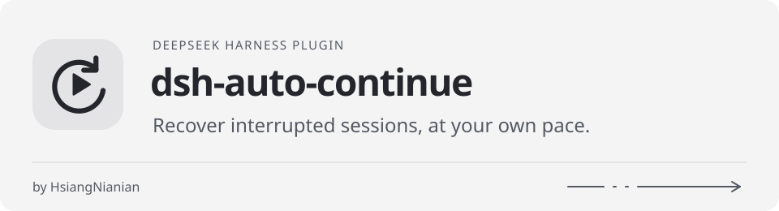
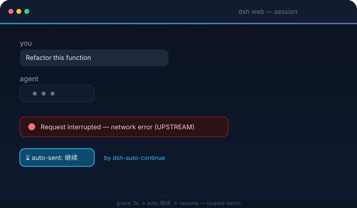
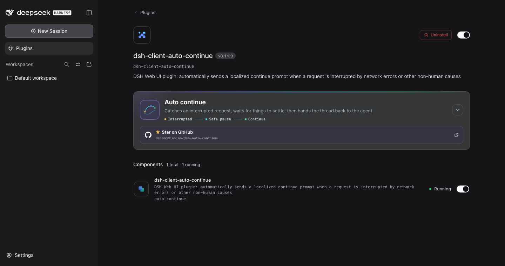
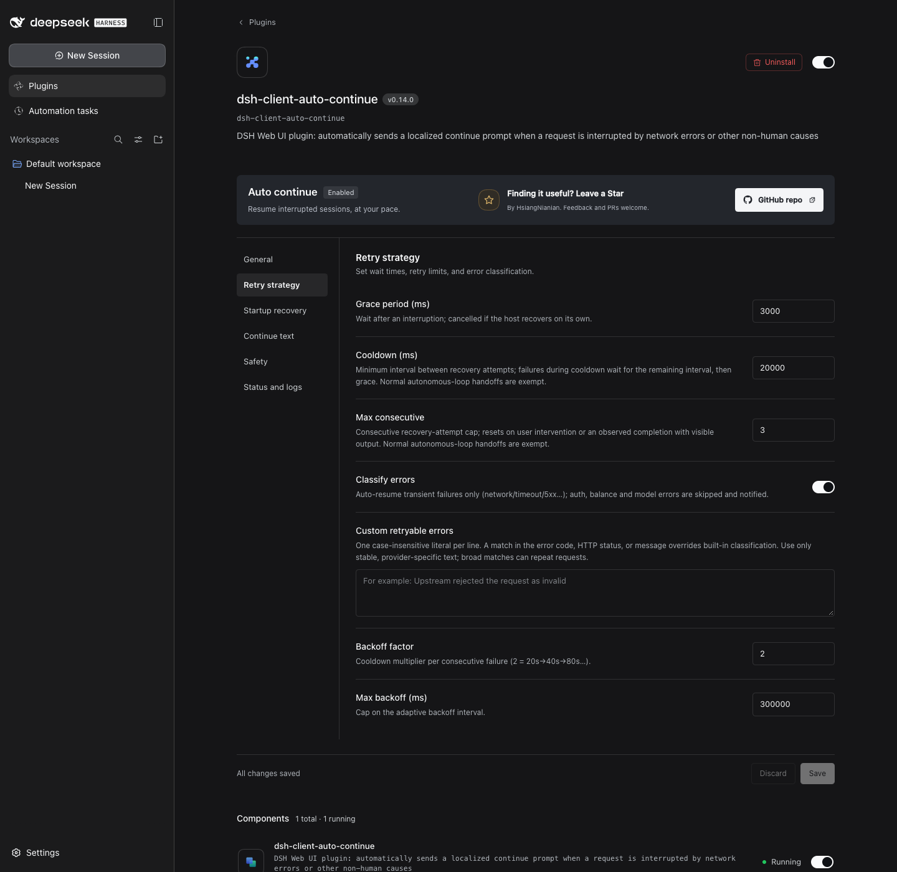
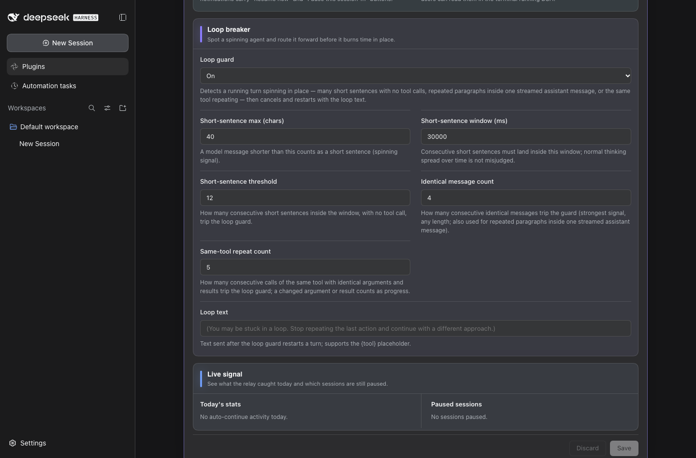

<p align="center">
  <picture>
    <source media="(prefers-color-scheme: dark)" srcset="docs/banner-dark.svg">
    
  </picture>
</p>

<h1 align="center">dsh-auto-continue</h1>

<p align="center">
  <em>DSH Web UI plugin — when a request is interrupted by a network error or any other non-human cause, it automatically sends “Continue” for you.</em>
</p>

<p align="center">
  <a href="https://www.npmjs.com/package/dsh-client-auto-continue"></a>
  <a href="https://www.npmjs.com/package/dsh-client-auto-continue"></a>
  <a href="https://github.com/HsiangNianian/dsh-auto-continue/stargazers"></a>
  <a href="https://github.com/HsiangNianian/dsh-auto-continue/blob/main/LICENSE"></a>
  <br>
  <a href="https://awesome-dsh-plugin.com"></a>
  <a href="https://www.dsh.so/artifact/dsh-auto-continue/"></a>
  <br>
  
  
  
</p>

<p align="center">
  <b>English</b> · <a href="README.zh.md">中文</a>
</p>

---

## What It Does

For [DeepSeek Harness](https://github.com/deepseek-ai/deepseek-harness) (`dsh web`): whenever a request in the web GUI gets interrupted by a **non-human cause**, the plugin simulates the user typing **“Continue”** and sends it, so the agent keeps working without manual intervention. The message enters the session log exactly like a manual prompt — the model sees it, and the interrupted work resumes. Since 0.8.0 the engine runs **inside the host process** (single instance), so it keeps watching even with every browser tab closed, and multiple open tabs can never double-send.



**Smart recovery** (all configurable):

- **Error classification** — transient failures (network / timeout / 5xx / 429…) are auto-resumed; permanent ones are **skipped** and notified, because retrying them never helps. A failure counts as permanent when its HTTP status is 401/403 or its code/message matches auth, credential/API-key, balance/quota, unknown-model, or context-length/overflow keywords. Provider-specific exceptions can be opted into with literal custom retryable patterns; turn classification off to resume everything
- **Adaptive backoff** — consecutive failures wait longer each time (cooldown × factor: 20s → 40s → 80s…), capped at the max backoff, instead of hammering a broken upstream
- **English / Chinese localization** — the settings card, built-in resume / guard / loop text, and browser notifications follow DSH's active UI language (initially selected from the browser language). Only `en` and `zh` are supported; other languages fall back to Chinese. Switching languages updates built-in defaults without overwriting custom text
- **Templated continue text** — `continueText` supports `{code}` `{message}` `{status}` `{tool}` `{turn}` `{errorCount}` `{sessionTitle}` `{elapsed}` placeholders, so the resume message can carry the failure context ("Continue ({tool} failed: {code})"); a **separate template** fires on `max-tokens` (e.g. "Continue the output without repeating anything already generated")
- **Idempotency guard** — before resuming, the plugin inspects the last tool call: if its result is unconfirmed (the turn died mid-tool, e.g. a `git push` that may have gone through), the resume message tells the model to check state first and not to rerun; if the tool is confirmed done, it says so and asks not to repeat it; a failed tool gets no guard (retrying it is the point). Both guard texts are configurable (`{tool}` / `{result}` placeholders)
- **Silent turn resume** — recover an observed model step or reasoning-only response that completes without visible output. A no-op turn with no model activity is left alone. Text, tool calls, images and extension blocks count as visible, including streamed output. Unobserved turns are not guessed to be silent. Explicit `no-visible-output` markers also recover after restart. Disabling **Resume silent turns** cancels queued silent sends; silent turns never reset the retry cap, even while the option is off.
- **Autonomous loop** — when enabled, resumes after every normally completed turn, looping until stopped manually. Successful resumes do not count toward the consecutive cap; only failures do — a turn that completes with no visible output counts as a failure, so a stuck model still stops at the cap instead of retrying forever. Global and per-session pause still apply, and the loop text is configurable (defaults to `Continue`).
- **Pause** — a global **Pause auto-continue** toggle in the settings card stops everything (live + scan) instantly; per-session pauses (e.g. via a notification button) suspend only one session until they expire. The **Resume now** notification button is the one explicit exception: pressing it is the user asking for exactly one send, pause or not
- **Notification buttons** — notifications carry **Resume now** (send immediately, ignoring cooldown, the consecutive cap and any pause) and **Pause this session 1h** actions
- **Loop guard** — watches **running** turns too. Four signals trip the guard, which cancels the turn and restarts it with a configurable loop text ("stop repeating, try another way"): the model repeating the **exact same message** several times (any length — e.g. "Let me test variants of the regex…" ×7), repeated near-duplicate paragraphs **inside one streamed assistant message**, many short messages inside a short time window with no tool call in between (the "Let me read…" spin), or the same tool called repeatedly with the **same arguments and the same results** (a changed argument or result counts as progress). The cancel carries an internal marker so it is never confused with a user stop — the restart only happens for guard-initiated cancels. Thresholds, the time window and the loop text are configurable
- **Stats panel** — the settings card shows today's auto-continue count, recoveries, failures, permanent skips, give-ups and loop breaks, broken down by error code, with a one-click reset
- **Browser notifications** — optional alerts when auto-continue fires, gives up, or hits a permanent error; the browser asks for permission on first use, and nothing is shown again after a denial

It watches the live event streams and reacts to:

| Event | Meaning |
| --- | --- |
| `turn/end` → `error` | Turn failed (model / network / timeout, …) |
| `turn/end` → `interrupted` | Crash-orphaned turn left behind by a host restart (recovered by the startup scan) |
| `turn/end` → `max-tokens` | Output token ceiling reached |
| `turn/end` → `completed` / `no-visible-output` with no visible output | Turn ended normally with reasoning only: no text, no tool call |
| `host/agent-error` | Agent failure with no turn position (only network/timeout-class messages auto-resume) |

**Never auto-continues:** user-aborted turns (`aborted`) or policy rejections (`blocked`); live `interrupted` turn-ends too — that marker is only written by crash repair when the host reloads, so orphaned turns are recovered by the startup scan, not the live path; sessions the host already resumed itself; running sessions; subagent sessions; anything inside the cooldown / consecutive-cap windows (configurable in the settings card, below). If an interrupted session already has queued turns, the continuation runs first and the existing turns retain their order behind it.

---

## How It Works

The host-side engine subscribes to the session event firehose inside the dsh host process — exactly one engine, regardless of how many tabs are open (the duplicate-send class of bugs cannot exist by construction). On an interruption it waits a **grace period** (default 3 s) — if the host starts a new turn by itself (`turn/start`), the auto-continue is cancelled — then sends the configured text through the agent registry (`agent.followup`, the same queue the Send button uses). When that queue already contains turns, the engine promotes only its newly inserted continuation before the host wakes the agent; it does not remove or reorder the queued user turns.

On host boot it also scans the live sessions: a session whose last turn ended with a non-human reason **within the scan window** (default 15 minutes), with no later `turn/start` or user message, gets resumed automatically too (e.g. the host crashed while the browser was closed — the agent-loop resumes the session and the engine picks it up).

The browser half is a thin shell: the settings card, plus a status bridge that shows notifications (with Resume now / Pause this session 1h buttons, routed back to the host engine) and feeds the card's stats / paused-sessions panels.

### Recovery workflow

The diagram summarizes the automatic recovery path, the loop-guard restart path, and the exit to human intervention. Click it to open the full-size version.

[](docs/auto-continue-workflow.en.svg)

## Quick Start

DSH plugins install into a **profile** (`dsh web` → `web` profile). The commands below install into the web profile; restart `dsh web` after installation. In the desktop app, install through its **Plugins** page instead.

> **For DSH 0.1.7, use plugin v0.11.9 or newer.** This guide and its screenshots use DSH **0.1.7-rc.2** with plugin **0.11.9**. Run `dsh --version` before installing and check the [official DSH releases](https://github.com/deepseek-ai/deepseek-harness/releases): preview releases may arrive before the public npm `latest` tag catches up.

On DSH 0.1.7, open **Plugins → dsh-client-auto-continue → Auto continue** to configure the plugin. **Settings → Built-in plugins** only shows component status; it has no editable configuration fields.

Older hosts retain **Settings → Plugins → Plugin configuration**. DSH 0.1.0-rc.6 and earlier are unsupported. If you previously installed with a symlink or edited the loader config by hand, follow [Migrating an older installation](#migrating-an-older-installation).

### From npm (recommended)

Published as [`dsh-client-auto-continue`](https://www.npmjs.com/package/dsh-client-auto-continue):

```bash
dsh plugin --profile web add dsh-client-auto-continue
dsh web
```

### Directly from GitHub (no clone needed)

Installs straight from the repository's default branch — built artifacts are committed, so no local clone or build step:

```bash
dsh plugin --profile web add github:HsiangNianian/dsh-auto-continue
dsh web
```

> This tracks the `main` branch rather than released tags — great for trying the latest changes, while the npm method above is the stable choice. Switching between install sources is just re-running `dsh plugin --profile web add <other-spec>`; the profile dependency is replaced in place.

### From this repository

Requires Node.js ≥ 18.

```bash
git clone https://github.com/HsiangNianian/dsh-auto-continue.git
cd dsh-auto-continue
npm install
npm run build

# the package carries its own cordis.patch.yml (dsh.bundle.patch),
# so the plugin row registers itself
dsh plugin --profile web add link:$(pwd)

dsh web
```

### Migrating an older installation

A manual loader entry can start the engine without registering a bundle in the **Plugins** page. Use the profile's package manager to install the bundle; a symlink and `insert` entry alone are no longer the recommended setup.

1. Let active work finish, then stop `dsh web`. Back up `package.json`, `cordis.patch.yml` and `pnpm-lock.yaml` in `~/.dsh/profiles/web/`, plus `~/.dsh/settings.yaml` if it exists. If you set `DSH_HOME`, use that directory instead of `~/.dsh`.
2. Keep your existing auto-continue values. Remove only the manually added `auto-continue` row **inside an `insert` list** (and the list if it becomes empty). The installed bundle supplies that row. A top-level `- id: auto-continue` with `config:` is a configuration override: **keep it**.
3. Install with either the npm or GitHub command above. In the profile's `package.json`, `dsh.profile.bundles` should now include `dsh-client-auto-continue`, alongside the existing DSH bundles. If it already does and the plugin appears in **Plugins**, this part is already complete.
4. On DSH 0.1.7, merge any saved values from the old `settings.yaml` → `auto-continue` section or the removed row's `config` into the profile's `cordis.patch.yml`. For example, a custom cooldown becomes:

   ```yaml
   - id: auto-continue
     config:
       cooldownMs: 45000 # example: preserve your own saved value
   ```

   Merge into an existing override instead of adding another one. Keep unrelated settings intact. DSH 0.1.7 reads this entry config; editing the old `settings.yaml` section will not update the new form.
5. Start `dsh web` again and reload the browser. Open **Plugins → dsh-client-auto-continue**, expand **Auto continue**, and check that your values are present. Save a change and reload to confirm it persists.

The `include:auto-continue` label in **Built-in plugins** is a normal loader prefix. It does not, by itself, indicate a legacy install or a duplicate engine.

### Verify & uninstall

```bash
dsh --profile web --dump-config | grep -A 4 'id: auto-continue'
```

The composed config should contain one `id: auto-continue` entry. In **Plugins → dsh-client-auto-continue**, check that the component is **Running** and that expanding **Auto continue** shows editable fields. With verbose logging enabled, engine activity appears in the terminal running DSH.

```bash
dsh plugin --profile web remove dsh-client-auto-continue   # npm / repo install
# also remove this plugin's config override from cordis.patch.yml, if present
dsh web
```

---

## Configuration

On **DSH 0.1.7**, open **Plugins** from the main sidebar, choose **dsh-client-auto-continue**, then expand the **Auto continue** card. This is separate from **Settings → Built-in plugins**, which only lists component status. Older DSH versions use **Settings → Plugins → Plugin configuration**.



Click the card header or its right-hand chevron to show the fields. The expanded card also contains a live **stats panel** (today's activity with a reset button) and **paused sessions** (each with a resume button).

The settings card groups controls by handoff, safety, recovery, loop breaking, and live status. Its header also keeps the open-source repository and a **Star on GitHub** shortcut within reach.

DSH 0.1.7 stores these values in the `auto-continue` entry's config in the active profile patch (`~/.dsh/profiles/web/cordis.patch.yml` for the default web profile). **Save** applies changes live without restarting the engine. Omitted fields use the defaults below.

Startup recovery polls every three seconds for sessions that load late, up to `freshMs` after the engine starts. Each settled session history is inspected once. `scanLimit` limits eligible recoveries per pass, so healthy or permanent-error sessions cannot crowd out interrupted ones. Pausing suspends recovery within the same window; unloading cancels the poller.

The browser mirrors DSH's active language into the internal `locale` field. Leave the seven localized text fields empty or omit them to follow that language automatically; any non-empty value is treated as your own template and is never rewritten when the language changes:

```yaml
- id: auto-continue
  config:
    locale: 'en' # normally managed by the browser
    paused: false
    continueText: ''
    resumeSilentTurns: true
    resumeCompletedTurns: false
    continueTextSilent: ''
    continueTextLoop: ''
    continueTextMaxTokens: ''
    guardTools: true
    guardPendingText: ''
    guardDoneText: ''
    graceMs: 3000
    cooldownMs: 20000
    maxConsecutive: 3
    scanOnBoot: true
    scanLimit: 8
    freshMs: 900000
    verbose: true
    classify: true
    retryableErrorPatterns: ''
    backoffFactor: 2
    backoffMaxMs: 300000
    notify: false
    loopGuard: true
    loopShortChars: 40
    loopWindowMs: 30000
    loopShortCount: 12
    loopRepeatText: 4
    loopToolRepeat: 5
    loopText: ''
```

<details>
<summary>Configuration files on older DSH versions</summary>

Older hosts store user settings in `~/.dsh/settings.yaml` under the plugin namespace instead of a profile entry:

```yaml
auto-continue:
  cooldownMs: 45000
```

When upgrading to DSH 0.1.7, move these values into the profile entry's `config` as described in [Migrating an older installation](#migrating-an-older-installation).

</details>

**How the card works:**



- Edits are **staged** — nothing reaches the disk until you hit **Save**; an unsaved badge marks the card while drafts are pending, and **Discard** drops them
- A field you changed shows an **Overridden** badge with a per-field **Reset to default** button that restores the built-in value
- Boolean fields are **tri-state**: *Inherit* (use the default) / *On* / *Off*
- Invalid drafts (non-numbers, values below the minimum) block the save with a hint
- In a read-only deployment the card shows the stored values but disables every control
- Changes apply immediately after Save and persist in the active profile config (or `~/.dsh/settings.yaml` on older hosts)

<details>
<summary>Live status and the Save / Discard buttons</summary>



</details>

| Field | Default | Description |
| --- | --- | --- |
| Pause auto-continue | `off` | Global pause: no live or scan auto-send fires, queued pending sends are cancelled |
| Continue text | `Continue` | Text automatically sent after an interruption |
| Continue text (max tokens) | `Continue` | Text sent when the output token ceiling is reached (same placeholders) |
| Resume silent turns | `on` | Resume a turn that ended normally with reasoning only (no text, no tool call); does not reset the consecutive count |
| Continue text (silent turn) | `Continue. Your previous turn ended with internal reasoning only, ...` | Text sent to resume a silent turn (same placeholders) |
| Autonomous loop (continue after every turn) | `off` | Resume after every normally completed turn until stopped manually; successful resumes do not count toward the consecutive cap (no-visible-output turns do count) |
| Continue text (autonomous loop) | `Continue` | Text sent on each autonomous-loop resume (same placeholders) |
| Idempotency guard | `on` | Inspect the last tool call before resuming and steer the model (see What It Does) |
| Loop guard | `on` | Detect a running turn spinning in place and restart it (see What It Does) |
| Short-sentence max (chars) | `40` | A model message shorter than this counts as a short sentence (spinning signal) |
| Short-sentence window (ms) | `30000` | Consecutive short sentences must land inside this window; normal thinking spread over time is not misjudged |
| Short-sentence threshold | `12` | Consecutive short sentences inside the window, with no tool call in between, trip the loop guard |
| Identical message count | `4` | Consecutive identical messages (any length) trip the loop guard — the strongest spinning signal; the same threshold is also used for repeated near-duplicate streamed paragraphs inside one message |
| Same-tool repeat count | `5` | Consecutive calls of the same tool with identical arguments and results trip the loop guard |
| Loop text | `(You may be stuck in a loop. Stop repeating the last action and continue with a different approach.)` | Text sent after the loop guard restarts a turn; `{tool}` placeholder |
| Guard text (unconfirmed result) | `(The previous tool "{tool}" may not have completed. Check its state before continuing and do not run it again.)` | Appended when the last tool may have partially executed; `{tool}` placeholder |
| Guard text (tool succeeded) | `(The previous tool "{tool}" completed successfully. Result: {result}; do not run it again. Continue from there.)` | Appended when the last tool is confirmed done; `{tool}` / `{result}` placeholders |
| Grace period (ms) | `3000` | Wait after an interruption; cancelled if the host recovers on its own |
| Cooldown (ms) | `20000` | Min interval between auto-continues per session (failed attempts count too) |
| Max consecutive | `3` | Max consecutive auto-continues; stops until a user intervenes or a turn completes with visible output |
| Scan on host startup | `on` | Recover interrupted sessions that become available during the startup window |
| Scan limit | `8` | Maximum eligible recoveries per pass, most recently active first |
| Scan window (ms) | `900000` | Maximum interruption age and duration of startup polling |
| Verbose logs | `on` | `[auto-continue]` engine logs in the DSH terminal |
| Classify errors | `on` | Auto-resume transient failures only; auth / balance / model errors are skipped and notified |
| Custom retryable errors | empty | One case-insensitive literal per line; matching the error code, HTTP status, or message explicitly overrides the built-in classifier |
| Backoff factor | `2` | Cooldown multiplier per consecutive failure (2 = 20s → 40s → 80s…) |
| Max backoff (ms) | `300000` | Cap on the adaptive backoff interval |
| Browser notifications | `off` | Notify when auto-continue fires, gives up, or hits a permanent error |

For a provider-specific error that is safe to resume (confirm first that manually sending "continue" recovers), add a narrow, stable fragment rather than disabling classification globally:

```yaml
- id: auto-continue
  config:
    retryableErrorPatterns: |-
      Upstream rejected the request as invalid
```

Patterns are literal substrings, not regular expressions. Blank lines are ignored; any matching line wins before the built-in permanent-error rules. Cooldown and consecutive-attempt limits still apply.

`continueText` (and `continueTextMaxTokens`, `continueTextSilent`) accept the placeholders `{code}`, `{message}`, `{status}`, `{tool}` (last tool call before the failure), `{turn}`, `{errorCount}` (consecutive failures including this one), `{sessionTitle}` (from the session list) and `{elapsed}` (time since the failure, e.g. `1m5s`) — e.g. `Continue ({tool}: {code})` becomes `Continue (git push: UPSTREAM)`. The guard texts accept `{tool}` and `{result}` (a truncated excerpt of the last tool output).

---

## Privacy & permissions

The recovery engine runs inside the DSH host. The browser provides the configuration card, live status and optional notifications:

- The engine reads session events and history through DSH's services. The browser talks to that host; the plugin adds no third-party service or credential store
- Recovery sends your configured text through `agent.followup`. The loop guard can cancel a looping turn through `agent.cancel` before sending its recovery prompt. Resumed agents continue with the session's existing tools and permissions
- Saving configuration uses DSH's settings API: the active profile patch on DSH 0.1.7, or `~/.dsh/settings.yaml` on older hosts
- Cooldowns, send caps, pauses and stats stay in host process memory and reset when the engine restarts
- Browser notifications are opt-in (`notify` setting) and permission is requested on first use only

---

## Development

The CI runtime test uses the published DSH 0.1.7 packages to check the HTTP bridge and live settings through the real Loader. Run `npm ci --prefix tests/fixtures/dsh-0.1.7` once, then `npm run test:runtime` after building.

```bash
npm run typecheck   # tsc --noEmit
npm run build       # lib/client.js + lib/index.js + lib/types
npm run watch       # rebuild on change; host HMR hot-reloads without a page refresh
npm run test        # node tests/simulate-host.mjs — 15 host-side behavioral scenarios
```

While `npm run watch` runs, the profile's client-hmr row polls `lib/client.js` every 500 ms and hot-reloads the plugin in the browser — no server restart needed for code changes.

CI installs from the lockfile, typechecks, rebuilds and verifies committed artifacts, runs the host and client simulations (including legacy settings scopes and DSH 0.1.7 configuration forms through Cordis), then runs [dsh-plugin-check](https://github.com/omdsh-dev/dsh-plugin-check). The same health check gates releases.

---

## Activity

[](https://gitstock.org/HsiangNianian/dsh-auto-continue)

---

## Links

- **Repository**: [github.com/HsiangNianian/dsh-auto-continue](https://github.com/HsiangNianian/dsh-auto-continue)
- **LINUX DO**: [linux.do](https://linux.do)
- **DeepSeek Harness**: [github.com/deepseek-ai/deepseek-harness](https://github.com/deepseek-ai/deepseek-harness)
- **dsh-plugin-check**: [github.com/omdsh-dev/dsh-plugin-check](https://github.com/omdsh-dev/dsh-plugin-check) — health-check your own DSH plugin repos

---

## License

[](LICENSE)

MIT © Hsiang Nianian
