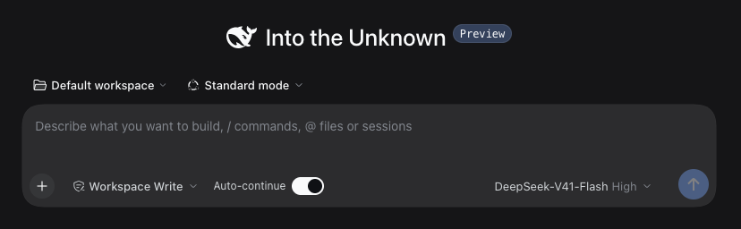

<p align="center">
  <picture>
    <source media="(prefers-color-scheme: dark)" srcset="docs/banner-dark.svg">
    
  </picture>
</p>

<h1 align="center">dsh-auto-continue</h1>

<p align="center">
  <em>Recover interrupted DSH sessions automatically, with an optional loop to continue after successful turns.</em>
</p>

<p align="center">
  <a href="https://www.npmjs.com/package/dsh-client-auto-continue"></a>
  <a href="https://www.npmjs.com/package/dsh-client-auto-continue"></a>
  <a href="https://github.com/HsiangNianian/dsh-auto-continue/stargazers"></a>
  <a href="https://github.com/HsiangNianian/dsh-auto-continue/blob/main/LICENSE"></a>
  <br>
  <a href="https://awesome-dsh-plugin.com"></a>
  <a href="https://www.dsh.so/artifact/dsh-auto-continue/"></a>
  <br>
  
  
  
</p>

<p align="center">
  <b>English</b> · <a href="README.zh.md">中文</a>
</p>

---

## What It Does

Automatic recovery for [DeepSeek Harness](https://github.com/deepseek-ai/deepseek-harness), in the Web UI and desktop app. When a recoverable failure interrupts a session, the plugin sends your configured continuation prompt through DSH. The engine runs **inside the host process**, so it keeps watching while browser tabs are closed; all tabs share that engine. Recovery is enabled by default. Continuing after successful turns is a separate, **opt-in autonomous loop**.

<p align="center">
  <picture>
    <source media="(prefers-reduced-motion: reduce)" srcset="docs/demo-static.svg">
    
  </picture>
</p>

**Smart recovery** (all configurable):

- **Composer switch** — enable or pause auto-continue directly beside the message input, using DSH's native switch. It controls all sessions in the current profile and saves immediately. Prefer a quieter toolbar? Hide it in the plugin settings without pausing recovery
- **Error classification** — transient failures (network / timeout / 5xx / 429…) are auto-resumed; permanent ones are **skipped** and notified, because retrying them never helps. A failure counts as permanent when its HTTP status is 401/403 or its code/message matches auth, credential/API-key, balance/quota, unknown-model, or context-length/overflow keywords. Provider-specific exceptions can be opted into with literal custom retryable patterns; turn classification off to resume everything
- **Adaptive backoff** — consecutive failures wait longer each time (cooldown × factor: 20s → 40s → 80s…), capped at the max backoff, instead of hammering a broken upstream
- **English / Chinese localization** — the settings card, built-in resume / guard / loop text, and browser notifications follow DSH's active UI language (initially selected from the browser language). Only `en` and `zh` are supported; other languages fall back to Chinese. Switching languages updates built-in defaults without overwriting custom text
- **Templated continue text** — `continueText` supports `{code}` `{message}` `{status}` `{tool}` `{turn}` `{errorCount}` `{elapsed}` placeholders, so the resume message can carry the failure context ("Continue ({tool} failed: {code})"); a **separate template** fires on `max-tokens` (e.g. "Continue the output without repeating anything already generated")
- **Idempotency guard** — before resuming, the plugin inspects the last tool call: if its result is unconfirmed (the turn died mid-tool, e.g. a `git push` that may have gone through), the resume message tells the model to check state first and not to rerun; if the tool is confirmed done, it says so and asks not to repeat it; a failed tool gets no guard (retrying it is the point). Both guard texts are configurable (`{tool}` / `{result}` placeholders)
- **Silent turn resume** — recover an observed model step or reasoning-only response that completes without visible output. A no-op turn with no model activity is left alone. Text, tool calls, images and extension blocks count as visible, including streamed output. Unobserved turns are not guessed to be silent. Explicit `no-visible-output` markers also recover after restart. Disabling **Resume silent turns** cancels queued silent sends; silent turns never reset the retry cap, even while the option is off.
- **Autonomous loop** — off by default (`resumeCompletedTurns`). When enabled, normally completed turns continue after the grace period, without the recovery cooldown or attempt cap. Reasoning-only turns and explicit `no-visible-output` endings still consume the recovery budget and obey backoff. Global pause, session pause, manual Stop and disabling the option stop the loop. Its prompt is separate from the loop guard’s prompt (`continueTextLoop`, default `Continue`).
- **Pause** — turning off **Auto-continue** in **General** and saving stops automatic sends from live events and startup scanning; per-session pauses (e.g. via a notification button) suspend only one session until they expire. **Resume now** requests one send even when both pauses are active. It leaves the pauses in place, so later automatic recovery and autonomous-loop sends remain paused
- **Notification buttons** — notifications carry **Resume now** (send immediately, ignoring cooldown, the consecutive cap and any pause) and **Pause this session 1h** actions
- **Loop guard** — watches **running** turns too. Four signals trip the guard, which cancels the turn and restarts it with a configurable loop text ("stop repeating, try another way"): the model repeating the **exact same message** several times (any length — e.g. "Let me test variants of the regex…" ×7), repeated near-duplicate paragraphs **inside one streamed assistant message**, many short messages inside a short time window with no tool call in between (the "Let me read…" spin), or the same tool called repeatedly with the **same arguments and the same results** (a changed argument or result counts as progress). The cancel carries an internal marker so it is never confused with a user stop — the restart only happens for guard-initiated cancels. Thresholds, the time window and the loop text are configurable
- **Stats panel** — the settings card shows today's auto-continue count, recoveries, failures, permanent skips, give-ups and loop breaks, broken down by error code, with a one-click reset
- **Browser notifications** — optional alerts for auto-continue events and successful settings saves. Saving a change to the notification switch confirms its new state, including one final confirmation when turning it off. The browser may ask for permission when you enable it; a denial is explained in the settings page and does not prevent saving.

It watches the live event streams and reacts to:

| Event | Meaning |
| --- | --- |
| `turn/end` → `error` | Turn failed (model / network / timeout, …) |
| `turn/end` → `interrupted` | Crash-orphaned turn left behind by a host restart (recovered by the startup scan) |
| `turn/end` → `max-tokens` | Output token ceiling reached |
| `turn/end` → `completed` / `no-visible-output` with no visible output | Observed model activity without visible output, or an explicit silent-ending marker |
| `turn/end` → `completed` | Continue a normal completion only when autonomous loop is enabled |

**Recovery stops for:** manual Stop, policy rejection (`blocked`), paused sessions, subagent sessions and the consecutive-attempt cap. A new turn or manual user message cancels a queued continuation. Live `interrupted` markers are left to the startup recovery scan. Recoverable failures during cooldown are **deferred**, not discarded. If an interrupted session already has queued turns, the continuation runs first and the existing turns retain their order behind it. The loop guard can separately cancel and restart a running turn that is repeating itself.

Subagent sessions stay under their parent agent's control. The plugin skips them during live recovery and startup scanning, ignores **Resume now** for them, and leaves them out of loop-guard cancellation. Any queued recovery is cancelled when a session is identified as a subagent.

---

## How It Works

The host-side engine subscribes to the session event firehose inside the dsh host process — one engine shared by every browser tab. On an interruption it waits a **grace period** (default 3 s) — if the host starts a new turn by itself (`turn/start`), the auto-continue is cancelled — then sends the configured text through the agent registry (`agent.followup`, the same queue the Send button uses). When that queue already contains turns, the engine promotes only its newly inserted continuation before the host wakes the agent; it does not remove or reorder the queued user turns.

On host boot it also scans the live sessions: a session whose last turn ended with a non-human reason **within the scan window** (default 15 minutes), with no later `turn/start` or user message, gets resumed automatically too (e.g. the host crashed while the browser was closed — the agent-loop resumes the session and the engine picks it up).

The browser provides the settings card and composer switch, plus a status bridge that shows notifications (with Resume now / Pause this session 1h buttons, routed back to the host engine) and feeds the card's stats / paused-sessions panels.

### Recovery workflow

The diagram summarizes the automatic recovery path, the loop-guard restart path, and the exit to human intervention. Click it to open the full-size version.

[](docs/auto-continue-workflow.en.svg)

## Quick Start

DSH plugins install into a **profile** (`dsh web` → `web` profile). The commands below install into the web profile; restart `dsh web` after installation. In the desktop app, install through its **Plugins** page instead.

### Compatibility

| DSH runtime | Plugin version | Configuration entry point |
| --- | --- | --- |
| **0.2.1-alpha.1** | **0.14.1 verified** | **Plugins → dsh-client-auto-continue** |
| **0.2.0-rc.1** | **0.12.1 or newer** | **Plugins → dsh-client-auto-continue** |
| **0.1.7-rc.2** | **0.11.9 or newer** | Same Plugins page |
| Older hosts with the legacy settings API | Legacy UI retained | **Settings → Plugins → Plugin configuration** |

DSH 0.1.0-rc.6 and earlier are unsupported. Automated runtime checks cover **0.1.7-rc.2**, **0.2.0-rc.1** and **0.2.1-alpha.1**. Desktop app versions and embedded DSH runtime versions are different; use the runtime version when checking compatibility. For the CLI, run `dsh --version`; see [official DSH releases](https://github.com/deepseek-ai/deepseek-harness/releases) for available versions.

**Plugins 0.11.9 and 0.12.0 are rejected by DSH 0.2.0-rc.1’s version check.** Upgrade the plugin to 0.12.1 or newer; its existing configuration-form integration works on this runtime. See [#50](https://github.com/HsiangNianian/dsh-auto-continue/issues/50).

On current DSH, **Settings → Built-in plugins** is a component inventory, not the configuration editor. Use the main **Plugins** page. The screenshots below show plugin **0.14.0** on **DSH 0.2.1-alpha.1**. If you previously installed with a symlink or hand-written loader entry, see [Migrating an older installation](#migrating-an-older-installation).

### From npm (recommended)

Published as [`dsh-client-auto-continue`](https://www.npmjs.com/package/dsh-client-auto-continue):

```bash
dsh plugin --profile web add dsh-client-auto-continue@latest
dsh web
```

### Updating an installed plugin

Let active work finish and stop DSH. Run the npm command above again to replace the installed version with `@latest`, then restart DSH and reload the browser. Existing configuration overrides remain in the profile. For a desktop installation, update the plugin from that app’s **Plugins** page and restart the app; updating the CLI’s `web` profile does not update the desktop profile.

### Directly from GitHub (no clone needed)

Installs straight from the repository's default branch — built artifacts are committed, so no local clone or build step:

```bash
dsh plugin --profile web add github:HsiangNianian/dsh-auto-continue
dsh web
```

> This tracks the `main` branch rather than released tags — great for trying the latest changes, while the npm method above is the stable choice. Switching between install sources is just re-running `dsh plugin --profile web add <other-spec>`; the profile dependency is replaced in place.

### From this repository

Use Node.js 22, the version used by CI.

```bash
git clone https://github.com/HsiangNianian/dsh-auto-continue.git
cd dsh-auto-continue
npm ci
npm run build

# the package carries its own cordis.patch.yml (dsh.bundle.patch),
# so the plugin row registers itself
dsh plugin --profile web add "link:$(pwd)"

dsh web
```

### Migrating an older installation

A manual loader entry can start the engine without registering a bundle in the **Plugins** page. Use the profile's package manager to install the bundle; a symlink and `insert` entry alone are no longer the recommended setup.

1. Let active work finish, then stop `dsh web`. Back up `package.json`, `cordis.patch.yml` and `pnpm-lock.yaml` in `~/.dsh/profiles/web/`, plus `~/.dsh/settings.yaml` if it exists. If you set `DSH_HOME`, use that directory instead of `~/.dsh`.
2. Keep your existing auto-continue values. Remove only the manually added `auto-continue` row **inside an `insert` list** (and the list if it becomes empty). The installed bundle supplies that row. A top-level `- id: auto-continue` with `config:` is a configuration override: **keep it**.
3. Install with either the npm or GitHub command above. In the profile's `package.json`, `dsh.profile.bundles` should now include `dsh-client-auto-continue`, alongside the existing DSH bundles. If it already does and the plugin appears in **Plugins**, this part is already complete.
4. On DSH 0.1.7 / 0.2, merge any saved values from the old `settings.yaml` → `auto-continue` section or the removed row's `config` into the profile's `cordis.patch.yml`. For example, a custom cooldown becomes:

   ```yaml
   - id: auto-continue
     config:
       cooldownMs: 45000 # example: preserve your own saved value
   ```

   Merge into an existing override instead of adding another one. Keep unrelated settings intact. DSH 0.1.7 / 0.2 reads this entry config; editing the old `settings.yaml` section will not update the new form.
5. Start `dsh web` again and reload the browser. Open **Plugins → dsh-client-auto-continue**, select the appropriate settings category, and check that your values are present. Save a change and reload to confirm it persists.

The `include:auto-continue` label in **Built-in plugins** is a normal loader prefix. It does not, by itself, indicate a legacy install or a duplicate engine.

### Verify & uninstall

```bash
dsh --profile web --dump-config | grep -A 4 'id: auto-continue'
```

The composed config should contain one `id: auto-continue` entry. In **Plugins → dsh-client-auto-continue**, check that the component is **Running** and that the **General** category shows editable fields. With verbose logging enabled, engine activity appears in the terminal running DSH.

```bash
dsh plugin --profile web remove dsh-client-auto-continue   # npm / repo install
# also remove this plugin's config override from cordis.patch.yml, if present
dsh web
```

---

## Troubleshooting

- **“Skipping profile bundle” / “incompatible with dsh 0.2.0-rc.1”:** update to plugin 0.12.1 or newer in the profile the app actually uses, then restart it. A version exemption is not needed for this fix.
- **Enabled, but no configuration fields:** open the main **Plugins** page, select the package and open **General**. The Built-in plugins status page has no editable fields.
- **`/api/auto-continue-bridge` returns 404:** check the DSH startup log and composed config to confirm the host component loaded. Refreshing the settings card cannot start a missing host component.

---

## Composer switch

Starting with **0.13.0**, an **Auto-continue** switch appears beside the message input by default. It uses DSH's native `Switch` and follows the active theme.



**On** allows automatic recovery; **Off** sets the existing global `paused` option. The change saves immediately and applies to **all sessions in the current profile**, with other open tabs updating too. This is separate from the notification action that pauses one session for an hour. Enabling it does not clear a session's individual pause.

To hide the switch, open **Plugins → dsh-client-auto-continue → General**, turn off **Show auto-continue switch in the composer**, then click **Save**. This only changes visibility; recovery keeps its current state. The corresponding config key is `showComposerToggle`, default `true`. Older hosts without the composer slot retain the settings card.

## Configuration

On **DSH 0.1.7 / 0.2**, open **Plugins** from the main sidebar, choose **dsh-client-auto-continue**, then select a settings category. This is separate from **Settings → Built-in plugins**, which only lists component status. Older DSH versions use **Settings → Plugins → Plugin configuration**.


Use **General**, **Retry strategy**, **Startup recovery**, **Continue text**, **Safety**, and **Status and logs** to find controls. Switching categories preserves unsaved changes. **Status and logs** contains today's activity and paused sessions.

The header places the plugin status and GitHub invitation side by side on one shared charcoal background. The status shows the saved global setting; edits take effect when you click **Save**.

With **Browser notifications** enabled, each successful save sends one confirmation from the tab where you saved. Turning notifications off sends a final confirmation if browser permission is already granted; later saves stay quiet. Discarded changes, invalid values, and failed saves do not send success notifications. If the browser blocks notifications, the settings page still confirms the save and explains the permission issue.

DSH 0.1.7 / 0.2 stores these values in the `auto-continue` entry's config in the active profile patch (`~/.dsh/profiles/web/cordis.patch.yml` for the default web profile). **Save** applies changes live without restarting the engine. Omitted fields use the defaults below.

Startup recovery polls every three seconds for sessions that load late, up to `freshMs` after the engine starts. Each settled session history is inspected once. `scanLimit` limits eligible recoveries per pass, so healthy or permanent-error sessions cannot crowd out interrupted ones. Pausing suspends recovery within the same window; unloading cancels the poller.

The browser mirrors DSH's active language into the internal `locale` field. Leave the seven localized text fields empty or omit them to follow that language automatically; any non-empty value is treated as your own template and is never rewritten when the language changes:

```yaml
- id: auto-continue
  config:
    locale: 'en' # normally managed by the browser
    paused: false
    showComposerToggle: true
    continueText: ''
    resumeSilentTurns: true
    resumeCompletedTurns: false
    continueTextSilent: ''
    continueTextLoop: ''
    continueTextMaxTokens: ''
    guardTools: true
    guardPendingText: ''
    guardDoneText: ''
    graceMs: 3000
    cooldownMs: 20000
    maxConsecutive: 3
    scanOnBoot: true
    scanLimit: 8
    freshMs: 900000
    verbose: true
    classify: true
    retryableErrorPatterns: ''
    backoffFactor: 2
    backoffMaxMs: 300000
    notify: false
    loopGuard: true
    loopShortChars: 40
    loopWindowMs: 30000
    loopShortCount: 12
    loopRepeatText: 4
    loopToolRepeat: 5
    loopText: ''
```

<details>
<summary>Configuration files on older DSH versions</summary>

Older hosts store user settings in `~/.dsh/settings.yaml` under the plugin namespace instead of a profile entry:

```yaml
auto-continue:
  cooldownMs: 45000
```

When migrating from the legacy settings file to DSH 0.1.7 / 0.2, move these values into the profile entry's `config` as described in [Migrating an older installation](#migrating-an-older-installation).

</details>

**How the card works:**


- Edits are **staged** — nothing reaches the disk until you hit **Save**; the footer indicates pending changes, and **Discard** drops them
- If you edit or reset a field while a save is in progress, the newer draft stays in the card. Click **Save** again after the current save finishes to apply it
- An overridden field shows a **Reset to default** button that removes the override and restores the inherited value (normally the built-in default)
- Boolean fields use native switches and are staged until Save. **Reset to default** removes the override and restores the inherited value. **Auto-continue** is on when recovery is enabled (`paused: false`)
- Invalid drafts (non-numbers, values below the minimum) block the save and mark their category, even when another category is selected
- In a read-only deployment the card shows the stored values but disables editing while keeping category navigation available
- Changes apply immediately after Save and persist in the active profile config (or `~/.dsh/settings.yaml` on older hosts)

<details>
<summary>Live status and the Save / Discard buttons</summary>


</details>

| Field | Default | Description |
| --- | --- | --- |
| Pause auto-continue | `off` | Global pause: no live or scan auto-send fires, queued pending sends are cancelled |
| Show auto-continue switch in the composer | `on` | Show the composer switch (`showComposerToggle`); hiding it does not pause recovery |
| Continue text | `Continue` | Text automatically sent after an interruption |
| Continue text (max tokens) | `Continue` | Text sent when the output token ceiling is reached (same placeholders) |
| Resume silent turns | `on` | Resume a turn that ended normally with reasoning only (no text, no tool call); does not reset the consecutive count |
| Continue text (silent turn) | `Continue. Your previous turn ended with internal reasoning only, ...` | Text sent to resume a silent turn (same placeholders) |
| Autonomous loop (continue after every turn) | `off` | Continue normal completions after grace, bypassing recovery cooldown/cap; reasoning-only and explicit silent endings still consume the retry budget |
| Continue text (autonomous loop) | `Continue` | Text sent on each autonomous-loop resume (same placeholders) |
| Idempotency guard | `on` | Inspect the last tool call before resuming and steer the model (see What It Does) |
| Loop guard | `on` | Detect a running turn spinning in place and restart it (see What It Does) |
| Short-sentence max (chars) | `40` | A model message shorter than this counts as a short sentence (spinning signal) |
| Short-sentence window (ms) | `30000` | Consecutive short sentences must land inside this window; normal thinking spread over time is not misjudged |
| Short-sentence threshold | `12` | Consecutive short sentences inside the window, with no tool call in between, trip the loop guard |
| Identical message count | `4` | Consecutive identical messages (any length) trip the loop guard — the strongest spinning signal; the same threshold is also used for repeated near-duplicate streamed paragraphs inside one message |
| Same-tool repeat count | `5` | Consecutive calls of the same tool with identical arguments and results trip the loop guard |
| Loop text | `(You may be stuck in a loop. Stop repeating the last action and continue with a different approach.)` | Text sent after the loop guard restarts a turn; `{tool}` placeholder |
| Guard text (unconfirmed result) | `(The previous tool "{tool}" may not have completed. Check its state before continuing and do not run it again.)` | Appended when the last tool may have partially executed; `{tool}` placeholder |
| Guard text (tool succeeded) | `(The previous tool "{tool}" completed successfully. Result: {result}; do not run it again. Continue from there.)` | Appended when the last tool is confirmed done; `{tool}` / `{result}` placeholders |
| Grace period (ms) | `3000` | Wait after an interruption; cancelled if the host recovers on its own |
| Cooldown (ms) | `20000` | Min interval between recovery attempts per session; failures during cooldown wait for the remaining interval, then grace |
| Max consecutive | `3` | Consecutive recovery-attempt cap; resets on user intervention or an observed completion with visible output. Normal autonomous-loop handoffs are exempt |
| Scan on host startup | `on` | Recover interrupted sessions that become available during the startup window |
| Scan limit | `8` | Maximum eligible recoveries per pass, most recently active first |
| Scan window (ms) | `900000` | Maximum interruption age and duration of startup polling |
| Verbose logs | `on` | `[auto-continue]` engine logs in the DSH terminal |
| Classify errors | `on` | Auto-resume transient failures only; auth / balance / model errors are skipped and notified |
| Custom retryable errors | empty | One case-insensitive literal per line; matching the error code, HTTP status, or message explicitly overrides the built-in classifier |
| Backoff factor | `2` | Cooldown multiplier per consecutive failure (2 = 20s → 40s → 80s…) |
| Max backoff (ms) | `300000` | Cap on the adaptive backoff interval |
| Browser notifications | `off` | Notify about auto-continue events and successful settings saves; confirm switching notifications on or off |

For a provider-specific error that is safe to resume (confirm first that manually sending "continue" recovers), add a narrow, stable fragment rather than disabling classification globally:

```yaml
- id: auto-continue
  config:
    retryableErrorPatterns: |-
      Upstream rejected the request as invalid
```

Patterns are literal substrings, not regular expressions. Blank lines are ignored; any matching line wins before the built-in permanent-error rules. Cooldown and consecutive-attempt limits still apply.

`continueText` (and `continueTextMaxTokens`, `continueTextSilent`, `continueTextLoop`) accept the placeholders `{code}`, `{message}`, `{status}`, `{tool}` (last tool call before the failure), `{turn}`, `{errorCount}` (consecutive failures including this one) and `{elapsed}` (time since the failure, e.g. `1m5s`) — e.g. `Continue ({tool}: {code})` becomes `Continue (git push: UPSTREAM)`. The guard texts accept `{tool}` and `{result}` (a truncated excerpt of the last tool output). The host engine currently leaves `{sessionTitle}` empty.

---

## Privacy & permissions

The recovery engine runs inside the DSH host. The browser provides the configuration card, live status and optional notifications:

- The engine reads session events and history through DSH's services. The browser talks to that host; the plugin adds no third-party service or credential store
- Recovery sends your configured text through `agent.followup`. The loop guard can cancel a looping turn through `agent.cancel` before sending its recovery prompt. Resumed agents continue with the session's existing tools and permissions
- Saving configuration uses DSH's settings API: the active profile patch on DSH 0.1.7 / 0.2, or `~/.dsh/settings.yaml` on older hosts
- Retry counters, cooldown timestamps, per-session pauses and stats stay in host process memory and reset when the engine restarts. The global `paused` setting is saved with your other configuration
- Browser notifications are opt-in (`notify` setting). Enabling and saving can request browser permission; denied permission is not requested again. Turning the option off never requests permission.

---

## Development

Use Node.js 22. Install both pinned runtime fixtures to reproduce CI locally:

```bash
npm ci
npm ci --prefix tests/fixtures/dsh-0.1.7
npm ci --prefix tests/fixtures/dsh-0.2.0
npm run typecheck
npm run build
npm test
npm run test:runtime
```

`npm test` covers recovery, autonomous-loop limits and toggles, child-session exclusion, manual resume during pauses, startup scanning, queue ordering, statistics, localization, settings UI lifecycle and edits made during pending saves. `npm run test:runtime` uses published DSH **0.1.7-rc.2** and **0.2.0-rc.1** Settings, Loader and HTTP services. It also runs the actual 0.2 profile compatibility gate and checks client activation with Cordis 4.0.4 when one settings provider is absent. The runtime harness controls agent events; it does not send requests to a model provider.

After editing a linked checkout, run `npm run build` to write the updated `lib/` files, then restart DSH and refresh the browser. Hosts with client HMR enabled can reload a rebuilt client bundle automatically.

CI typechecks, rebuilds, runs both test suites, verifies committed `lib/` artifacts and runs [dsh-plugin-check](https://github.com/omdsh-dev/dsh-plugin-check). The same checks gate releases. See [screenshot capture notes](docs/screenshots/README.md) when updating the UI documentation.

---

## Activity

[](https://gitstock.org/HsiangNianian/dsh-auto-continue)

---

## Links

- **Repository**: [github.com/HsiangNianian/dsh-auto-continue](https://github.com/HsiangNianian/dsh-auto-continue)
- **LINUX DO**: [linux.do](https://linux.do)
- **DeepSeek Harness**: [github.com/deepseek-ai/deepseek-harness](https://github.com/deepseek-ai/deepseek-harness)
- **dsh-plugin-check**: [github.com/omdsh-dev/dsh-plugin-check](https://github.com/omdsh-dev/dsh-plugin-check) — health-check your own DSH plugin repos

---

## License

[](LICENSE)

MIT © Hsiang Nianian
