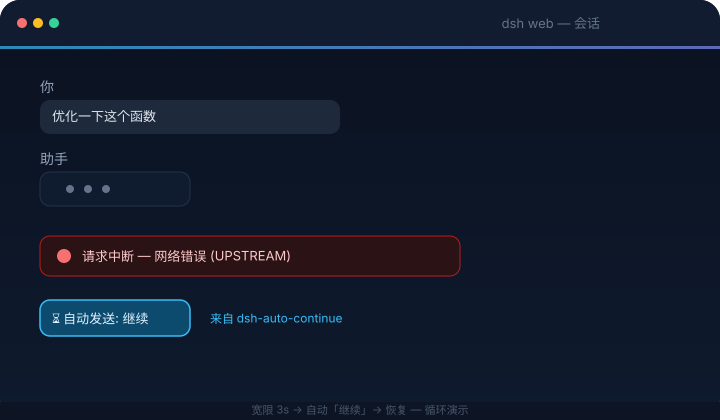
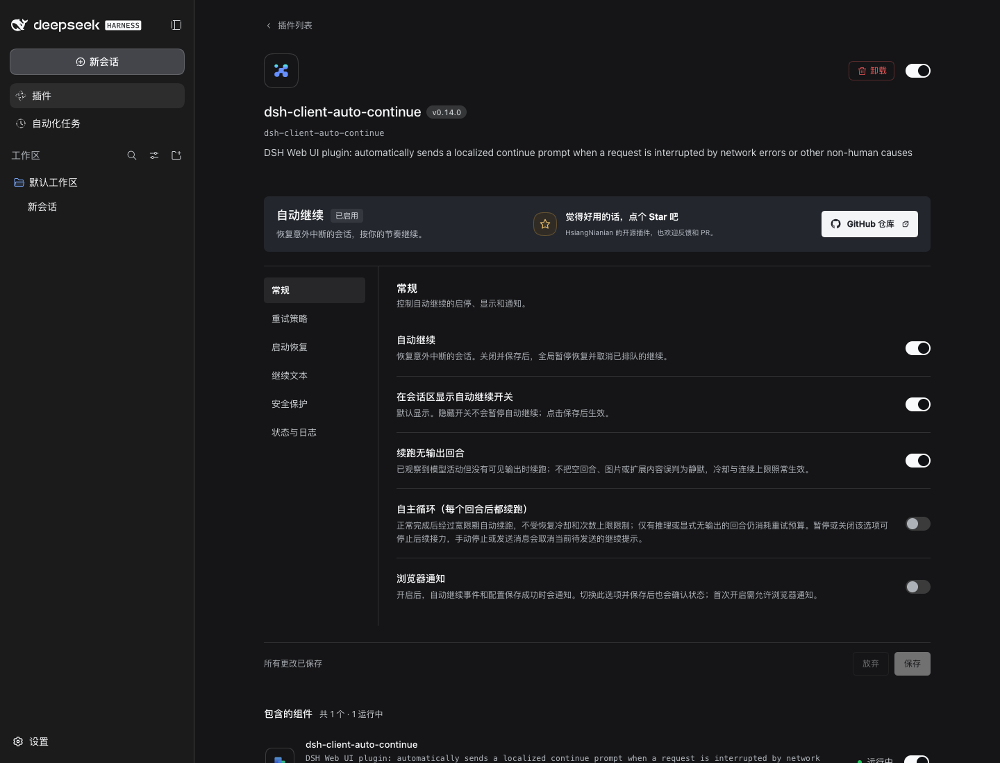
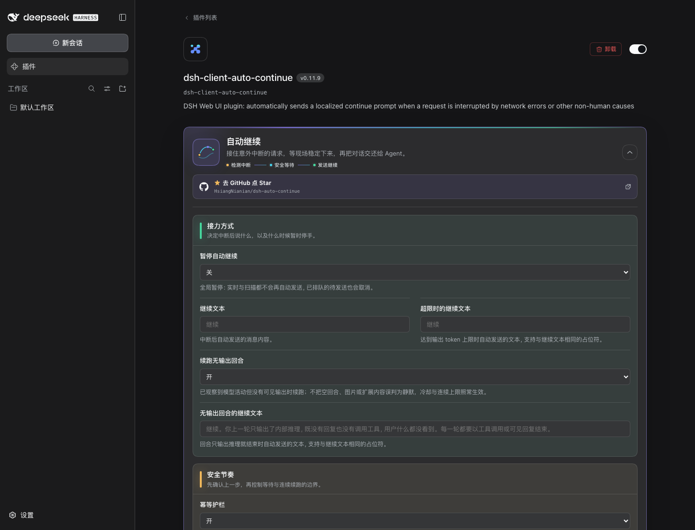
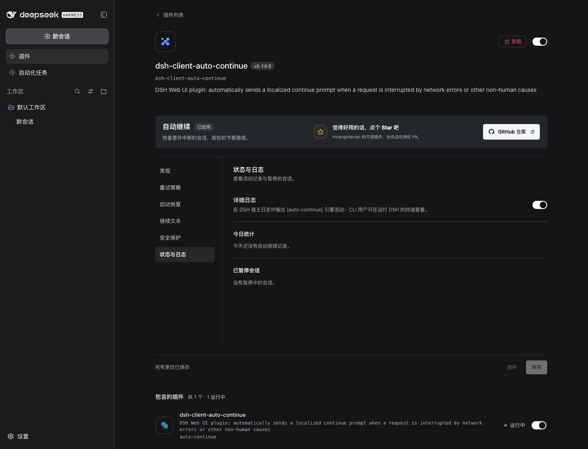

<p align="center">
  <picture>
    <source media="(prefers-color-scheme: dark)" srcset="docs/banner-zh-dark.svg">
    
  </picture>
</p>

<h1 align="center">dsh-auto-continue</h1>

<p align="center">
  <em>自动恢复中断的 DSH 会话，也可选择开启自主循环，在正常完成后继续工作。</em>
</p>

<p align="center">
  <a href="https://www.npmjs.com/package/dsh-client-auto-continue"></a>
  <a href="https://www.npmjs.com/package/dsh-client-auto-continue"></a>
  <a href="https://github.com/HsiangNianian/dsh-auto-continue/stargazers"></a>
  <a href="https://github.com/HsiangNianian/dsh-auto-continue/blob/main/LICENSE"></a>
  <br>
  <a href="https://awesome-dsh-plugin.com"></a>
  <a href="https://www.dsh.so/artifact/dsh-auto-continue/"></a>
  <br>
  
  
  
</p>

<p align="center">
  <a href="README.md">English</a> · <b>中文</b>
</p>

---

## 它做什么

为 [DeepSeek Harness](https://github.com/deepseek-ai/deepseek-harness) 的 Web 界面和桌面应用提供自动恢复。会话因可恢复错误中断时，插件通过 DSH 发送你配置的继续提示。引擎运行在**宿主进程**中，浏览器标签页关闭后仍会工作，多个标签页共享同一个引擎。默认开启中断恢复；成功回合后也继续工作的**自主循环需要手动开启**。



**智能恢复**(全部可配置):

- **错误分类** — 临时性错误(网络 / 超时 / 5xx / 429 等)自动续跑; 永久性错误跳过并通知, 因为重试也没用。判定为永久性的条件: HTTP 状态码 401/403, 或 code/message 命中认证、凭据/API Key、余额/配额、模型不存在、上下文长度/超限等关键词。provider 专属例外可由用户显式填写普通文本匹配; 关闭分类后则全部自动继续
- **自适应退避** — 连续失败时等待时间递增(冷却 × 系数: 20s → 40s → 80s…), 有上限, 不再对故障上游狂轰滥炸
- **中英文本地化** — 设置卡片、内置续跑 / 护栏 / 循环文案以及浏览器通知都跟随 DSH 当前界面语言(初始值来自浏览器语言)。只支持 `en` 和 `zh`, 其他语言回落中文; 切换语言只会替换内置默认值, 不会覆盖用户自定义文本
- **模板化继续文本** — `continueText` 支持 `{code}` `{message}` `{status}` `{tool}` `{turn}` `{errorCount}` `{elapsed}` 占位符, 续跑消息可携带失败上下文(如「继续 (git push 失败: UPSTREAM)」); 达到 `max-tokens` 时使用**另一套模板**(如「继续输出, 不要重复已生成的内容」)
- **幂等护栏** — 续跑前检查上一步工具调用: 结果未确认(回合在工具执行中途夭折, 如 `git push` 可能已经推上去了)时, 续跑消息会提示模型先确认状态、不要重复执行; 工具已确认成功时说明已完成、请勿重复; 工具失败则不加护栏(重试本来就是目的)。两段护栏文本都可配置(支持 `{tool}` / `{result}` 占位符)
- **无输出回合续跑** — 已观察到模型步骤或推理回复，但回合正常结束且没有可见输出时自动恢复。没有模型活动的空回合不会触发；文本、工具调用、图片、扩展块和已显示的流式内容均算可见输出。未观察到开始的回合不会被猜测为静默。启动后也能恢复显式的 `no-visible-output` 标记。关闭开关会取消排队中的静默续跑；即使开关关闭，静默回合也不会清零重试上限。
- **自主循环** — 默认关闭（`resumeCompletedTurns`）。开启后，正常完成的回合经过宽限期便会续跑，不受恢复冷却和次数上限约束。仅有推理的回合和显式 `no-visible-output` 仍消耗重试预算并遵守退避。全局暂停、会话暂停、手动停止或关闭该选项都会停止循环。自主循环使用单独的提示文本 `continueTextLoop`（默认 `继续`），与循环守卫的提示文本不同。
- **暂停** — 设置卡片里的全局 **暂停自动继续** 开关会停止实时事件与启动扫描触发的自动发送; 会话级暂停(如通过通知按钮)只挂起单个会话, 到期自动恢复。即使两种暂停同时生效，通知里的 **立即续跑** 仍可发送一次。发送后保留暂停状态，后续自动恢复和自主循环仍受暂停约束
- **通知按钮** — 通知带 **立即续跑**(无视冷却、连续上限与暂停, 马上发送)和 **暂停该会话 1 小时** 按钮
- **循环守卫** — 连**运行中的回合**也盯着, 四个信号都会触发守卫(取消当前回合并用可配置的循环提示文本重启, 「停止重复, 换一种方式」): 模型**连续输出完全相同的消息**(不限长度, 如 "Let me test variants of the regex…" 连续 7 遍)、单条流式 assistant 消息内部出现连续近似重复段落、短时间内连续多条短句且期间无工具调用(典型的「Let me read…」空转)、或同一工具被连续反复调用且**参数与结果都相同**(参数或结果有变化视为有进展)。取消带有内部来源标记, 绝不会与用户手动停止混淆——只有守卫发起的取消才会重启。阈值、时间窗与提示文本都可配置
- **统计面板** — 设置卡片展示今日自动继续次数、恢复成功、继续后失败、永久性跳过、达上限停止、循环打断, 按错误码统计, 可一键清零
- **浏览器通知** — 可选: 自动继续成功 / 放弃 / 遇到永久性错误时弹出提醒; 首次使用时请求权限, 被拒绝后不再打扰

插件监听实时事件流, 对以下情况作出反应:

| 事件 | 含义 |
| --- | --- |
| `turn/end` → `error` | 回合失败(模型 / 网络 / 超时等) |
| `turn/end` → `interrupted` | 宿主崩溃重启后遗留的中断回合(由启动扫描恢复) |
| `turn/end` → `max-tokens` | 达到输出 token 上限 |
| `turn/end` → `completed` / `no-visible-output` 且无可见输出 | 已观察到模型活动但没有可见输出，或收到显式无输出结束标记 |
| `turn/end` → `completed` | 仅在开启自主循环时续跑正常完成的回合 |

**恢复会停止于：**用户手动停止、策略拒绝（`blocked`）、暂停、子代理会话以及连续次数上限。新回合开始或用户手动发送消息会取消待发送的继续提示；实时 `interrupted` 标记交给启动扫描处理。冷却期间出现的可恢复错误会**延后重试，不会直接丢弃**。已有排队消息时，续跑消息先执行，原有消息随后按原顺序处理。循环守卫则可以单独打断并重启正在重复动作的回合。

子代理会话由父代理管理。插件会在实时恢复和启动扫描中跳过它们，忽略对它们发起的 **立即续跑**，循环守卫也不会打断它们。识别出子代理会话时，已排队的恢复操作会被取消。

---

## 工作原理

宿主侧引擎在 dsh 宿主进程内订阅会话事件 firehose——**多个浏览器标签页共享一个引擎**。检测到中断后先等待一个**宽限期**(默认 3 秒)——若宿主自行开启了新回合(`turn/start`), 自动继续即取消——然后经 agent 注册表(`agent.followup`, 与「发送」按钮同一个排队通道)发送配置的文本。若队列已有消息, 引擎会在宿主唤醒 agent 之前只把本次续跑消息移到队首, 不删除或重排用户消息。

宿主启动时还会扫描存活会话: 最后一个回合在**扫描时间窗**(默认 15 分钟)内以非人为原因结束、且其后没有新回合或用户消息的会话, 会被自动续跑(例如浏览器关闭期间宿主崩溃——agent-loop 恢复会话后引擎接着接手)。

浏览器半侧是瘦壳: 设置卡片 + 一条状态桥(展示通知, 带「立即续跑 / 暂停该会话 1 小时」按钮并把动作回传给宿主引擎; 驱动卡片里的统计与暂停面板)。

### 恢复流程

下图汇总了自动恢复主链、循环守卫重启路径和等待人工介入的出口。点击图片可查看原尺寸版本。

[](docs/auto-continue-workflow.svg)

## 快速开始

DSH 插件安装进 **profile**(`dsh web` 对应 `web` profile)。下面的命令用于 Web 版, 安装后重启 `dsh web`。桌面版请通过应用内的**插件**页面安装。

### 版本兼容

| DSH 内核 | 插件版本 | 配置入口 |
| --- | --- | --- |
| **0.2.0-rc.1** | **0.12.1 或更新版本** | **插件 → dsh-client-auto-continue → 自动继续** |
| **0.1.7-rc.2** | **0.11.9 或更新版本** | 同上，从主侧栏的插件页进入 |
| 使用旧设置 API 的宿主 | 保留旧版设置界面兼容 | **设置 → 插件 → 插件配置** |

不支持 DSH 0.1.0-rc.6 及更早版本。自动化运行时测试覆盖 **0.1.7-rc.2** 和 **0.2.0-rc.1**。桌面应用版本不等于内置的 DSH 内核版本，请按内核版本判断兼容性；CLI 可运行 `dsh --version`，可用版本见 [DSH 官方 Releases](https://github.com/deepseek-ai/deepseek-harness/releases)。

**插件 0.11.9 和 0.12.0 会被 DSH 0.2.0-rc.1 的版本检查拦截。** 请升级到 0.12.1 或更新版本；现有配置表单接口可在该内核正常工作。详见 [#50](https://github.com/HsiangNianian/dsh-auto-continue/issues/50)。

当前 DSH 的**设置 → 内置插件**是组件状态列表，配置应从主侧栏的**插件**页面进入。下方截图使用 **DSH 0.2.0-rc.1 + 插件 0.12.1**。此前通过软链或手写 Loader 条目安装的用户，请参考[旧安装迁移](#旧安装迁移)。

### 从 npm 安装(推荐)

已发布为 [`dsh-client-auto-continue`](https://www.npmjs.com/package/dsh-client-auto-continue):

```bash
dsh plugin --profile web add dsh-client-auto-continue@latest
dsh web
```

### 更新已安装的插件

等当前任务结束后停止 DSH，再次执行上面的 npm 安装命令，用 `@latest` 更新插件，然后重启 DSH 并刷新浏览器。已有配置覆盖项会保留。桌面版请从应用内的**插件**页面更新并重启应用；更新 CLI 的 `web` profile 不会同步更新桌面版的 profile。

### 直接从 GitHub 安装(无需克隆)

直接从仓库默认分支安装——构建产物已提交入库, 无需本地克隆或构建:

```bash
dsh plugin --profile web add github:HsiangNianian/dsh-auto-continue
dsh web
```

> 该方式跟踪 `main` 分支而不是发布 tag——适合尝鲜最新改动, 稳定性首选上面的 npm 方式。切换安装来源只需重新执行 `dsh plugin --profile web add <其他来源>`, profile 依赖会被就地替换。

### 从本仓库安装

请使用与 CI 相同的 Node.js 22。

```bash
git clone https://github.com/HsiangNianian/dsh-auto-continue.git
cd dsh-auto-continue
npm ci
npm run build

# 包自带 cordis.patch.yml(通过 dsh.bundle.patch 声明),
# 插件行会自动注册
dsh plugin --profile web add "link:$(pwd)"

dsh web
```

### 旧安装迁移

手动添加 Loader 条目可以启动引擎, 但未必会在**插件**页面登记 bundle。请通过 profile 的包管理命令安装; 不再推荐只创建软链并添加 `insert` 条目。

1. 等当前任务结束后停止 `dsh web`。备份 `~/.dsh/profiles/web/` 下的 `package.json`、`cordis.patch.yml`、`pnpm-lock.yaml`, 以及存在时的 `~/.dsh/settings.yaml`。如果设置了 `DSH_HOME`, 请用该目录替代 `~/.dsh`。
2. 保留已有的自动继续参数。只删除 **`insert` 列表内**手动添加的 `auto-continue` 行; 若列表因此变空, 一并删除空列表。安装包会提供该行。顶层的 `- id: auto-continue` 搭配 `config:` 是配置覆盖项, **应当保留**。
3. 使用上面的 npm 或 GitHub 命令安装。profile 的 `package.json` 中, `dsh.profile.bundles` 应在原有 DSH bundles 之外包含 `dsh-client-auto-continue`。如果已经包含, 且**插件**页面已有该插件, 这一步已经完成。
4. 在 DSH 0.1.7 / 0.2 上, 将旧 `settings.yaml` → `auto-continue` 段落或已移除条目的 `config` 参数合并到 profile 的 `cordis.patch.yml`。例如, 自定义冷却时间写成:

   ```yaml
   - id: auto-continue
     config:
       cooldownMs: 45000 # 示例: 请保留你原先设置的值
   ```

   若已有覆盖项, 请合并到其中, 不要重复添加。保留其他设置。DSH 0.1.7 / 0.2 读取的是条目配置, 修改旧 `settings.yaml` 段落不会更新新版表单。
5. 重新启动 `dsh web` 并刷新浏览器。打开**插件 → dsh-client-auto-continue**, 展开**自动继续**, 检查旧参数是否保留。保存一次修改并刷新, 确认配置持久化正常。

**内置插件**里显示的 `include:auto-continue` 是正常的 Loader 前缀, 单凭这个名字不能判断为旧安装或重复引擎。

### 验证与卸载

```bash
dsh --profile web --dump-config | grep -A 4 'id: auto-continue'
```

合并后的配置应只有一个 `id: auto-continue` 条目。在**插件 → dsh-client-auto-continue**中确认组件**运行中**, 展开**自动继续**后能编辑字段。开启详细日志后, 引擎活动会输出到运行 DSH 的终端。

```bash
dsh plugin --profile web remove dsh-client-auto-continue   # npm / 仓库安装
# cordis.patch.yml 中若有该插件的配置覆盖项, 也一并移除
dsh web
```

---

## 常见问题

- **提示 “skipping profile bundle” 或 “incompatible with dsh 0.2.0-rc.1”：** 在应用实际使用的 profile 中升级到插件 0.12.1 或更新版本，再重启应用。此修复不需要授予版本豁免。
- **已启用，但看不到配置：** 从主侧栏打开**插件**，选择该包并展开**自动继续**；内置插件状态页没有可编辑字段。
- **`/api/auto-continue-bridge` 返回 404：** 检查 DSH 启动日志与合并配置，确认宿主组件已加载。刷新配置卡片不能启动缺失的宿主组件。

---

## 配置

在 **DSH 0.1.7 / 0.2** 中, 从主侧栏打开**插件**, 选择 **dsh-client-auto-continue**, 再展开**自动继续**卡片。**设置 → 内置插件**是单独的组件状态列表, 不能在其中编辑配置。旧版 DSH 的入口仍为**设置 → 插件 → 插件配置**。



点击卡片标题或右侧箭头即可展开字段。卡片内还带有**统计面板**(今日活动, 可一键清零)和**已暂停会话**列表(每个都可单独解除)。

新版配置卡会按接力方式、安全节奏、恢复雷达、循环断路器与现场状态组织配置; 卡片顶部也直接放出了开源仓库和 **Star on GitHub** 入口。

DSH 0.1.7 / 0.2 将这些值保存在当前 profile patch 的 `auto-continue` 条目 config 中(默认 Web profile 对应 `~/.dsh/profiles/web/cordis.patch.yml`)。点**保存**后实时生效, 无需重启引擎。省略的字段使用下表默认值。

启动恢复会每三秒等待一次延迟加载的会话，在引擎启动后的 `freshMs` 时间窗结束。每个已就绪会话的历史只检查一次，`scanLimit` 只限制每轮符合条件的恢复数量，正常会话或永久错误不会挤占名额。暂停会在同一时间窗内挂起恢复，卸载插件会取消轮询。

浏览器会把 DSH 当前语言同步到内部 `locale` 字段。下面七个本地化文本字段保持留空或直接省略时, 会自动跟随语言; 任何非空值都视为用户自己的模板, 切换语言时不会改写:

```yaml
- id: auto-continue
  config:
    locale: 'zh' # 通常由浏览器自动维护
    paused: false
    continueText: ''
    resumeSilentTurns: true
    resumeCompletedTurns: false
    continueTextSilent: ''
    continueTextLoop: ''
    continueTextMaxTokens: ''
    guardTools: true
    guardPendingText: ''
    guardDoneText: ''
    graceMs: 3000
    cooldownMs: 20000
    maxConsecutive: 3
    scanOnBoot: true
    scanLimit: 8
    freshMs: 900000
    verbose: true
    classify: true
    retryableErrorPatterns: ''
    backoffFactor: 2
    backoffMaxMs: 300000
    notify: false
    loopGuard: true
    loopShortChars: 40
    loopWindowMs: 30000
    loopShortCount: 12
    loopRepeatText: 4
    loopToolRepeat: 5
    loopText: ''
```

<details>
<summary>旧版 DSH 的配置文件</summary>

旧版宿主将用户设置保存在 `~/.dsh/settings.yaml` 的插件命名空间下, 而非 profile 条目中:

```yaml
auto-continue:
  cooldownMs: 45000
```

从旧设置文件迁移到 DSH 0.1.7 / 0.2 时, 请按[旧安装迁移](#旧安装迁移)将这些值移入 profile 条目的 `config`。

</details>

**卡片操作说明:**



- 修改是**暂存式**的——点「保存」之前不会写入磁盘; 有待保存草稿时卡片显示「未保存」徽章, 「放弃」可丢弃草稿
- 保存期间继续修改或重置字段时，新的草稿会保留在卡片中；等待当前保存结束后，再点一次「保存」即可应用
- 改动过的字段会带「已覆盖」徽章, 并有逐字段的「恢复默认」按钮（移除覆盖项，恢复继承值，通常为内置默认值）
- 布尔字段是三态:**继承**(用默认)/ 开 / 关
- 非法输入(非数字、小于最小值)会阻止保存并给出提示
- 只读部署中卡片只显示已存值, 所有控件禁用
- 保存后立即生效，持久化在当前 profile 配置中（旧版宿主使用 `~/.dsh/settings.yaml`）

<details>
<summary>现场状态与底部的保存 / 放弃按钮</summary>



</details>

| 字段 | 默认 | 说明 |
| --- | --- | --- |
| 暂停自动继续 | 关 | 全局暂停: 实时与扫描都不再自动发送, 已排队的待发送也会取消 |
| 继续文本 | `继续` | 中断后自动发送的消息内容 |
| 超限时的继续文本 | `继续` | 达到输出 token 上限时自动发送的文本(支持相同占位符) |
| 续跑无输出回合 | 开 | 回合正常结束但只有推理(没有文本、没有工具调用)时自动续跑; 不清零连续次数 |
| 无输出回合的继续文本 | `继续。你上一轮只输出了内部推理, ...` | 续跑无输出回合时发送的文本(支持相同占位符) |
| 自主循环（每个回合后都续跑） | 关 | 正常完成后经过宽限期续跑，不受恢复冷却和上限限制；仅有推理和显式无输出结束仍消耗重试预算 |
| 自主循环的继续文本 | `继续` | 自主循环续跑时发送的文本(支持相同占位符) |
| 幂等护栏 | 开 | 续跑前检查上一步工具调用并给出指引(见「它做什么」) |
| 循环守卫 | 开 | 检测运行中的回合空转并重启(见「它做什么」) |
| 短句长度上限 (字符) | `40` | 模型消息文本短于该值计为一条短句(空转信号) |
| 短句时间窗 (ms) | `30000` | 连续短句必须落在这个时间窗内; 正常思考的短文本散布在长时间里不会被误判 |
| 连续短句阈值 | `12` | 时间窗内连续多少条短句且期间无工具调用时判定空转循环 |
| 相同消息重复次数 | `4` | 连续输出多少条完全相同的消息时判定空转(不限长度, 最强信号); 同一阈值也用于单条流式消息内连续近似重复段落 |
| 同工具重复次数 | `5` | 同工具+同参数+同结果的连续调用多少次时判定死循环 |
| 循环提示文本 | `(检测到你可能陷入循环, 请停止重复刚才的动作, 换一种方式继续)` | 打断后重启回合时发送的文本; 支持 {tool} 占位符 |
| 结果未确认时的护栏文本 | `(上一步工具「{tool}」可能未完成, 先确认状态再继续, 不要重复执行)` | 上一步工具可能已部分执行时附加; 支持 {tool} 占位符 |
| 工具已成功时的护栏文本 | `(上一步工具「{tool}」已完成, 结果: {result}; 不要重复执行, 直接继续)` | 上一步工具已确认成功时附加; 支持 {tool} / {result} 占位符 |
| 宽限期 (ms) | `3000` | 中断后等待的时长; 期间宿主自行恢复则取消 |
| 冷却时间 (ms) | `20000` | 同一会话恢复尝试的最小间隔；期间出现的失败会等待剩余冷却，再进入宽限期 |
| 最大连续次数 | `3` | 连续恢复尝试上限；用户介入或观察到有可见输出的成功回合后重置。正常完成后的自主循环接力不计入 |
| 启动恢复扫描 | 开 | 恢复启动时间窗内延迟加载的中断会话 |
| 扫描会话数 | `8` | 每轮最多恢复的符合条件的会话数，优先最近活动的会话 |
| 扫描时间窗 (ms) | `900000` | 中断的最大年龄，同时限制启动轮询的持续时间 |
| 详细日志 | 开 | 在运行 DSH 的终端输出 `[auto-continue]` 引擎日志 |
| 错误分类 | 开 | 仅自动恢复临时性错误; 认证 / 余额 / 模型等永久性错误跳过并通知 |
| 自定义可恢复错误 | 空 | 每行一个大小写不敏感的普通文本片段; 命中错误码、HTTP 状态或消息时显式覆盖内置分类 |
| 退避系数 | `2` | 连续失败时冷却间隔的倍率(2 = 20s → 40s → 80s…) |
| 最大退避间隔 (ms) | `300000` | 自适应退避的上限 |
| 浏览器通知 | 关 | 自动继续成功 / 放弃 / 遇到永久性错误时弹通知 |

遇到确认可以安全续跑的 provider 专属错误时(先确认手动发送「继续」确实能恢复), 应添加足够具体、稳定的片段, 而不是全局关闭错误分类:

```yaml
- id: auto-continue
  config:
    retryableErrorPatterns: |-
      Upstream rejected the request as invalid
```

匹配项是普通子串, 不是正则表达式。空行会被忽略; 任一行命中后会优先于内置永久错误规则。冷却与最大连续次数仍然生效。

`continueText`（以及 `continueTextMaxTokens`、`continueTextSilent`、`continueTextLoop`）支持占位符 `{code}`、`{message}`、`{status}`、`{tool}`(失败前最后一次工具调用)、`{turn}`、`{errorCount}`(连续失败次数, 含本次)和 `{elapsed}`(距失败经过的时间, 如 `1m5s`)——例如 `继续 ({tool}: {code})` 会变成 `继续 (git push: UPSTREAM)`。护栏文本支持 `{tool}` 与 `{result}`(上一步工具输出的截断摘要)。当前宿主引擎会将 `{sessionTitle}` 替换为空字符串。

---

## 隐私与权限

恢复引擎运行在 DSH 宿主进程中, 浏览器负责配置卡片、实时状态和可选通知:

- 引擎通过 DSH 服务读取会话事件和历史, 浏览器与该宿主通信; 插件不新增第三方服务或凭据存储
- 恢复时通过 `agent.followup` 发送你配置的文本。循环守卫可先通过 `agent.cancel` 停止空转回合, 再发送恢复提示; 续跑的 Agent 沿用会话已有的工具和权限
- 保存配置使用 DSH 的设置 API: DSH 0.1.7 / 0.2 写入当前 profile patch, 旧版宿主写入 `~/.dsh/settings.yaml`
- 重试计数、冷却时间戳、会话级暂停与统计保存在宿主进程内存中，引擎重启后重置；全局 `paused` 开关随其他配置持久化保存
- 浏览器通知是可选开启的(`notify` 设置), 仅在首次使用时请求一次权限

---

## 开发

使用 Node.js 22，安装两个锁定版本的运行时测试环境，即可在本地执行 CI 检查：

```bash
npm ci
npm ci --prefix tests/fixtures/dsh-0.1.7
npm ci --prefix tests/fixtures/dsh-0.2.0
npm run typecheck
npm run build
npm test
npm run test:runtime
```

`npm test` 覆盖错误恢复、自主循环上限与开关、子会话排除、暂停期间手动续跑、启动扫描、队列顺序、统计、本地化、设置界面生命周期及保存期间继续编辑的情况。`npm run test:runtime` 使用已发布的 DSH **0.1.7-rc.2** 和 **0.2.0-rc.1** Settings、Loader、HTTP 组件，并运行真实的 0.2 profile 兼容检查，以及 Cordis 4.0.4 中缺少其中一种设置服务时的客户端激活测试。运行时测试使用受控的 agent 事件，不会向模型服务发送请求。

修改链接的本地仓库后，运行 `npm run build` 写入最新的 `lib/` 产物，再重启 DSH 并刷新浏览器。开启 client HMR 的宿主可自动重新加载已构建的客户端包。

CI 执行类型检查、构建、两组测试、已提交 `lib/` 产物校验及 [dsh-plugin-check](https://github.com/omdsh-dev/dsh-plugin-check)，发布也受这些检查约束。更新界面文档时请参考[截图采集说明](docs/screenshots/README.md)。

---

## 活跃度

[](https://gitstock.org/HsiangNianian/dsh-auto-continue)

---

## 链接

- **仓库**: [github.com/HsiangNianian/dsh-auto-continue](https://github.com/HsiangNianian/dsh-auto-continue)
- **LINUX DO**: [linux.do](https://linux.do)
- **DeepSeek Harness**: [github.com/deepseek-ai/deepseek-harness](https://github.com/deepseek-ai/deepseek-harness)
- **dsh-plugin-check**: [github.com/omdsh-dev/dsh-plugin-check](https://github.com/omdsh-dev/dsh-plugin-check) — 给自己的 DSH 插件仓库做健康体检

---

## License

[](LICENSE)

MIT © Hsiang Nianian
